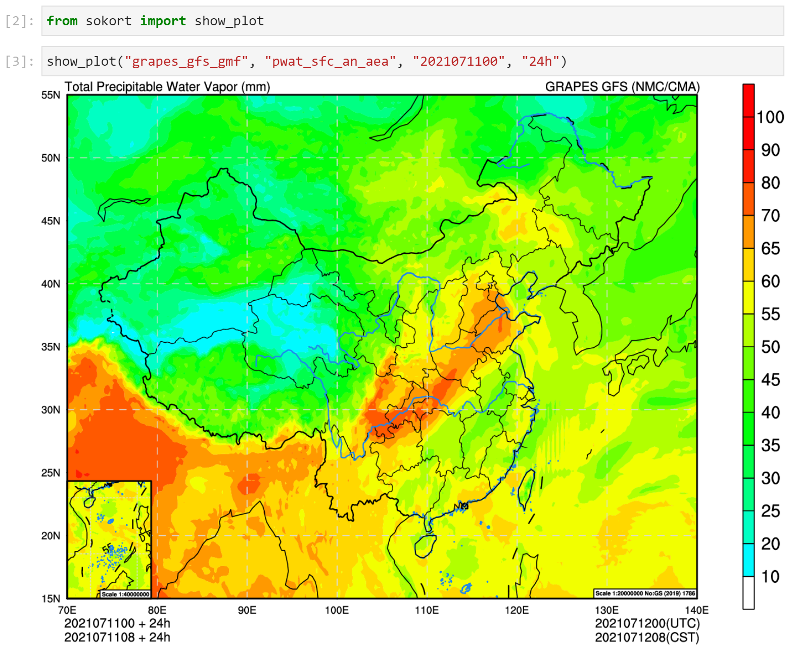

# sokort

> CEMC Graphics Script Tool

封装中国气象局地球系统数值预报中心 (CEMC) 数值预报业务系统使用的图片制作脚本。

支持使用 NCL 和 Python 的部分绘图任务，目前已集成的业务系统如下：

- CMA-GFS 全球预报系统 (`cma_gfs`)
- CMA-MESO 区域预报系统 (`cma_meso`)
- CMA-TYM 区域台风预报系统 (`cma_tym`)

## 安装

从 Github 项目主页下载最新的代码，并使用 pip 安装。

本项目不包含业务系统使用的任何图片库及图形绘制脚本，如果需要使用，请联系 CEMC。

推荐部署在 CMA-PI 高性能计算机或挂载二级存储的服务器上。

### 额外 Python 包

如果使用 CMA-PI 或二级存储中的数据自动查找功能，请安装下面 Python 包：

- [reki](https://github.com/nwpc-oper/reki)

### 其他软件

需要使用到的系统软件：

- NCL (绘图)
- Matplotlib (绘图)
- ImageMagick (图片转格式，裁剪图片)
- ksh (执行脚本)

请使用操作系统软件管理器或 conda 安装。

## 配置

本项目使用配置文件设置业务系统绘图脚本库的位置，参看 `config` 文件夹。

在运行前使用 `NWPC_GRAPHICS_CONFIG` 环境变量设置主配置文件 `config.yaml` 的路径，
或者手动调用 `load_config()` 函数设置。

如果在 CMA-PI 中使用，可以直接使用 `tool/cma-pi` 下提供的预设配置文件和环境加载脚本。

## 使用

### Jupyter Notebook

启动 Jupyter Notebook，执行下面代码。
绘制并显示 GRAPES GFS 全球预报系统 2021 年 7 月 11 日 00 时次 24 小时的整层可降水量。

```python
from sokort import show_plot

show_plot("cma_gfs", "pwat_sfc_an_aea", "2021071100", "24h")
```

在 Jupyter Notebook 中运行效果如下图所示



更多 Jupyter Notebook 示例请浏览 `example` 目录。

### 命令行程序

本项目提供命令行接口。
下面的命令行代码绘制上面的示例，并调用系统默认的图片浏览器显示图片。

```shell
python -m sokort show \
    --system=cma_gfs \
    --plot-type=pwat_sfc_an_aea \
    --start-time=2021071100 \
    --forecast-time=24h
```

## LICENSE

Copyright 2020-2022, perillaroc at cemc-oper。

`sokort` 以 [Apache License, Version 2.0](./LICENSE) 协议授权。

本项目涉及的数值预报业务系统及图片制作脚本版权均属于 CEMC。